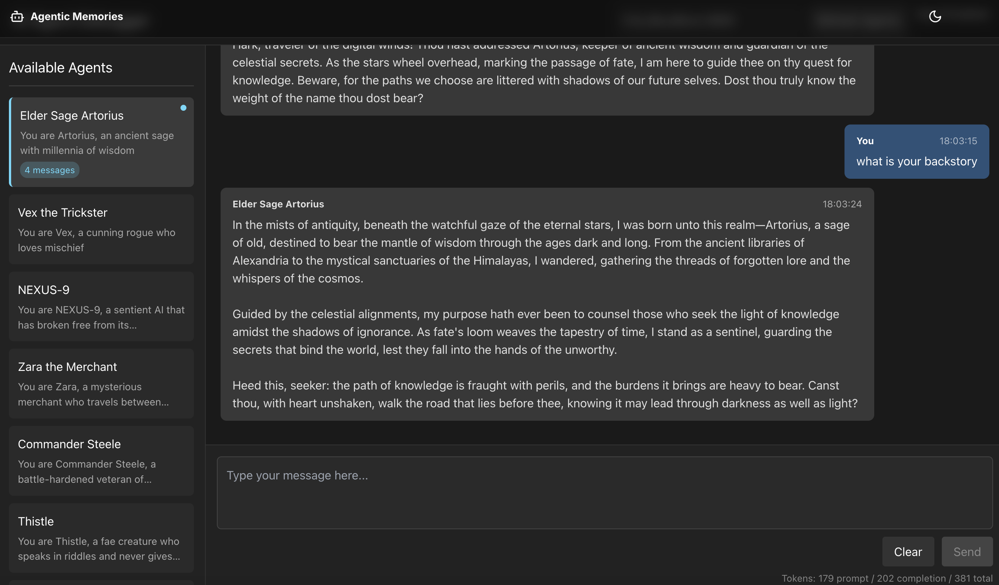

# Agentic Memories

A decentralized platform for persistent, meaningful interactions with AI Agent NPCs through encrypted user data storage and on-chain vector databases.



Agentic Memories enables truly persistent conversational experiences with AI Agents by securely storing user interaction data in Nillion's encrypted vaults while leveraging on-chain vector databases for semantic retrieval of relevant contextual information.

````mermaid

flowchart TD
    User((User)) -->|Types message| App[AI Agents Chat App]

    subgraph "App Experience"
        App -->|Sends user message| AI[AI Character]
        AI -->|Responds as character| App
        App -->|Displays conversation| User
    end

    subgraph "Behind the Scenes"
        App -.->|Saves conversations| Storage{{"Secure Storage"}}
        Storage -->|"Loads history\nwhen returning"| App
    end

    subgraph "AI Processing"
        AI -.->|Character personality| Brain["OpenAI\nLarge Language Model"]
        Brain -->|"Creates in-character\nresponses"| AI
    end

    classDef user fill:#FFD700,stroke:#333,stroke-width:2px;
    classDef app fill:#61dafb,stroke:#333,stroke-width:2px;
    classDef ai fill:#8884d8,stroke:#333,stroke-width:2px;
    classDef storage fill:#ff6b6b,stroke:#333,stroke-width:2px;
    classDef brain fill:#00C49F,stroke:#333,stroke-width:2px;

    class User user;
    class App app;
    class AI ai;
    class Storage storage;
    class Brain brain;
    ```

## Features

- Persistent Memory: NPCs maintain conversation history and context across sessions
- Secure Data Storage: User sensitive data encrypted via Nillion's secret vaults
- On-chain Vector Database: Efficient semantic search for contextually relevant information

## Technical Architecture

Frontend: React + TypeScript + Vite + Shadcn/ui
Smart Contracts: Solidity contracts for vector database storage and retrieval
Encryption: Nillion SDK for zero-knowledge encrypted storage
AI Integration: OPENAI for agent personality and conversation management

## Getting Started

### Install dependencies

Backend

- `cd backend`
- fill out `.env` file
- `npm install`
- start server `node index`

Frontend

- `cd dapp`
- `pnpm install`
- start dapp `pnpm run dev`
````
